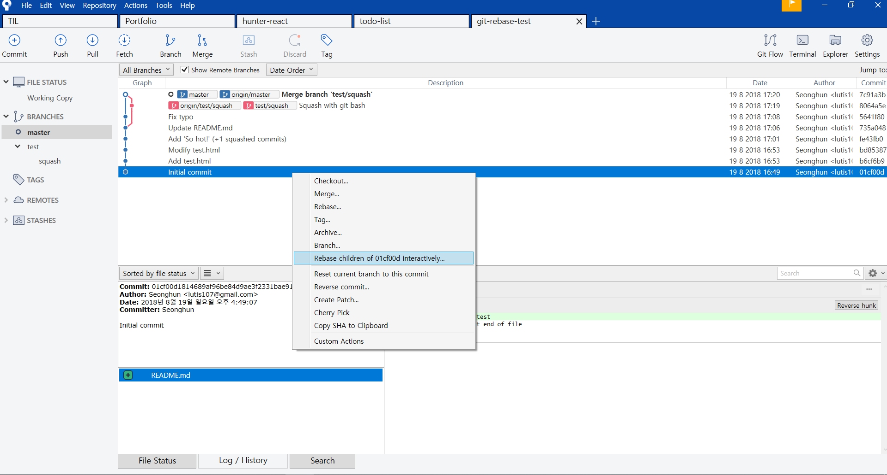
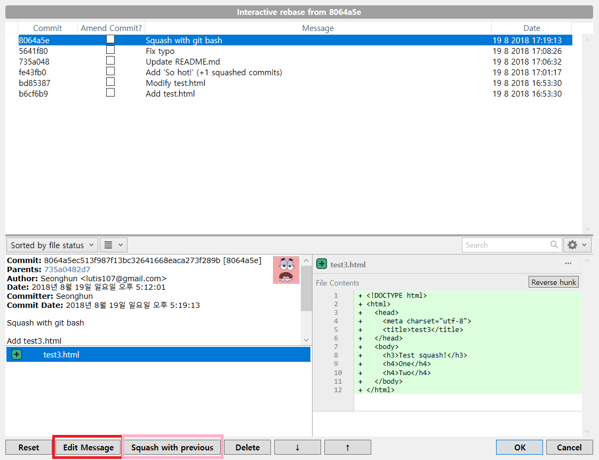

# git-rebase-test

- Rebase children of 01cf00d(`hash-value`) interactively.
  - Edit Message
  - Squash with previous

## Sourcetree
### #1


### #2


## Git bash
> https://git-scm.com/docs/git-rebase <br>
> https://git-scm.com/book/en/v2/Git-Tools-Rewriting-History

$ git rebase -i HEAD~{last commits}
```
$ git rebase -i HEAD~3
```

```
pick 53e32fb Add test3.html
squash b2as00a Add One
squash c1a6b23 Add Two
...
```

- Commands
  - `p`, `pick` use commit
  - `r`, `reword` use commit, but edit the commit message
  - `e`, `edit` use commit, but stop for amending
  - `s`, `squash` use commit, but meld into previous commit
  - `f`, `fixup` like "squash", but discard this commit's log message
  - `x`, `exec` run command (the rest of the line) using shell
